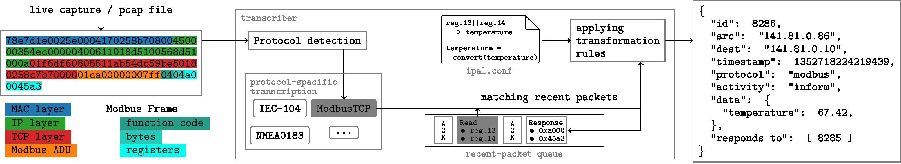

# IPAL - Transcriber

This repository is part of IPAL - an Industrial Protocol Abstraction Layer. IPAL aims to establish an abstract representation of industrial network traffic for subsequent unified and protocol-independent industrial intrusion detection. IPAL consists of a [transcriber](https://github.com/fkie-cad/ipal_transcriber) to automatically translate industrial traffic into the IPAL representation, an [IDS Framework](https://github.com/fkie-cad/ipal_ids_framework) implementing various industrial intrusion detection systems (IIDSs), and a collection of evaluation [datasets](https://github.com/fkie-cad/ipal_datasets). For details about IPAL, please refer to our publications listed down below.

Cyber-physical systems are increasingly threatened by sophisticated attackers, also attacking the physical aspect of systems. Supplementing protective measures, industrial intrusion detection systems promise to detect such attacks. However, due to industrial protocol diversity and lack of standard interfaces, great efforts are required to adapt these technologies to a large number of different protocols. To address this issue, we propose the Industrial Protocol Abstraction Layer (IPAL) - a common representation of industrial communication as input for industrial intrusion detection systems.

This software (`ipal-transcriber`) implements the automatic translation of industrial network traffic into IPAL for a variety of industrial protocols. As shown in the overview figure, the transcriber reads live network captures or pcap files and converts them into the IPAL representation.

###### Overview Figure



###### Implemented Protocols

| Implemented Protocols | Status      | Supported Message Types                                      |
| --------------------- | ----------- | ------------------------------------------------------------ |
| CIP                   | Rudimentary | Code: 76, 77                                                 |
| Goose                 | Moderate    |                                                              |
| IEC 60870-5-104       | Well    | U\_Format <br /> I\_Format: 1-21, 30-40, 45-51, 58-64, 70, 100-106 |
| IEC 61162-450         | Moderate    | UdPbC, no tags                                               |
| Modbus TCP            | Moderate    | Function Codes: 1, 2, 3, 4, 5, 6, 8, 15, 16, 43              |
| MQTT                  | Rudimentary | Basic MQTT 3.1                                               |
| NMEA0183              | Well        | DBT, DPT, GGA, GLL, GNS, GSA, GSV, HDM, HDT, RMC, ROT, RPM, TLL, TTM, VBW, VHW, VLW, VTG, ZDA, RMB, APB, RSA, DTM, Q, AIVDM |
| S7                    | Rudimentary | Job: 1, 3<br />Function Code: 4, 5                           |
| DNP3                  | Rudimentary | Function Code: 0-2, 7,8, 13,14, 20, 24, 129, 130<br /> objects (group-id:var): 1:2, 2:1, 20:{0,2}, 50:3, 52:2, 60:{1-4}, 80:1 |
| EtherCAT              | Rudimentary | TODO: add matching data |
| MavLink 2.0           | Rudimentary | Depends on the message definitions parsed |

###### Publications

- Konrad Wolsing, Eric Wagner, Antoine Saillard, and Martin Henze. 2022. IPAL: Breaking up Silos of Protocol-dependent and Domain-specific Industrial Intrusion Detection Systems. In 25th International Symposium on Research in Attacks, Intrusions and Defenses (RAID 2022), October 26–28, 2022, Limassol, Cyprus. ACM, New York, NY, USA, 17 pages. [https://doi.org/10.1145/3545948.3545968 ](https://doi.org/10.1145/3545948.3545968)
- Wolsing, Konrad, Eric Wagner, and Martin Henze. "Poster: Facilitating Protocol-independent Industrial Intrusion Detection Systems." *Proceedings of the 2020 ACM SIGSAC Conference on Computer and Communications Security*. 2020 [https://doi.org/10.1145/3372297.3420019](https://doi.org/10.1145/3372297.3420019)

## Getting started

###### Prerequisites

`ipal-trascriber` requires `tshark` to be installed. See [https://tshark.dev/setup/install/](https://tshark.dev/setup/install/) for installation instructions for your operating system.

###### Installation (pip)

Use `python3 -m pip install .` to install the scripts and dependencies system-wide using the `pip` [python package installer](https://pip.pypa.io/en/stable/installation/). This will install dependencies and the `transcriber` modules to the local site packages and add the `ipal-transcriber`, `ipal-state-extractor`, `ipal-minimize`, and `ipal-join` scripts to the `PATH`. The scripts can then be invoked system-wide (e.g. `ipal-transcriber -h`).

###### Installation (venv)

Install it locally with `misc/install.sh` or manually with:

```bash
python3 -m venv venv
source venv/bin/activate

python3 -m pip install -r requirements.txt
```

The scripts can then be invoked after activating the virtual environment from the root of the project repository, e.g.:

```bash
source venv/bin/activate
./ipal-transcriber -h
deactivate
```

###### Installation (docker)

Use `docker build -t ipal-ids-transcriber:latest .` to build a Docker image with a `pip` installation of the project and development dependencies. The scripts can then be used within containers using the built image, e.g.:

```bash
docker run -it ipal-ids-transcriber:latest /bin/bash
ipal-transcriber -h
```

#### Using the Transcriber

`ipal-transcriber` can be used on network interfaces (```--interface```)  or traffic captures (```--pcap```). Set  ```--ipal.output``` either to a file to write the output to, or use '-' to write to *stdout*. If the filename ends with '.gz' it is automatically compressed. 

An optional rule file (```--rules```) allows modifying the output by renaming, removing, or modifying process names and values. For some protocols, e.g. Modbus, request packets need to be cached to properly parse responses. ```--timeout``` defines an upper bound on how long a packet is cached for. Each message can be labeled as malicious or benign, which can be used for the later evaluation of intrusion detection methods. The default value is taken from ```--malicious.default```. Provide a file with packet-specific or time interval labels  with ```--malicious```.

```bash
./ipal-transcriber -h
usage: ipal-transcriber [-h] [--interface INTERFACE] [--pcap FILE] [--protocols STR [STR ...]] [--rules FILE] [--timeout INT] [--malicious FILE] [--malicious.default BOOL] [--crc STR]
                        [--ipal.output FILE] [--log STR] [--logfile FILE] [--compresslevel INT] [--version] [--state.output FILE] [--filter LIST] [--complete-only BOOL]
                        [--state-in-message BOOL]
                        {default,timeslice} ...

options:
  -h, --help            show this help message and exit
  --interface INTERFACE
                        traffic input interface (Use either this or --pcap)
  --pcap FILE           path to pcap file (Use either this or --interface)
  --protocols STR [STR ...]
                        specify a subset of the available transcribers ['cip', 'dnp3', 'goose', 'iec104', 'iec450', 'modbus', 'mqtt', 'nmea0183udp', 's7', 'ethercat']. (Default: all)
  --rules FILE          file containing rules to transform transcribed messages.
  --timeout INT         number of milliseconds a packet can be responded to. Used for response matching (Default: 250ms)
  --malicious FILE      Attack json file for labeling the packets according to the attacks in a dataset.
  --malicious.default BOOL
                        set this option to 'true' or 'false' to define default malicious annotation. (Default: None). Can be used in combination with --malicious
  --crc STR             options for CRC calculations are at 'transport', 'application', combined with 'or', or 'and'. (Default: and)
  --ipal.output FILE    output location for ipal messages ('-' stdout, '*.gz' compress).
  --log STR             define logging level as one of DEBUG, INFO, WARNING, ERROR, or CRITICAL. (Default: WARNING)
  --logfile FILE        define file to log to. (Default: stderr)
  --compresslevel INT   set the gzip compress level. 0 no compress, 1 fast/large, ..., 9 slow/tiny. (Default: 9)
  --version             show program's version number and exit
  --state.output FILE   output location for state information. ('-' stdout, '*.gz' compress)
  --filter LIST         semicolon separated list of state names to filter for. (Default: no filter)
  --complete-only BOOL  output complete states after filtering only. (Default: True)
  --state-in-message BOOL
                        embed state inside the messages. (Default: False)

State Extractors:
  {default,timeslice}   These are available state extractor methods. Use -h for further options on each method.
    default             Simple last value buffer of all variables
    timeslice           Outputs complete state in regular time slices.
```

###### Message Format

The transcriber parses each industrial protocol packet and writes one JSON line for each packet to the output. The 'id' is unique for each message. Source ('src') and destination ('dest') are strings with different address levels separated by ":". E.g. IP:Port:Device for Modbus which can address sub-devices within one connection in theory. Activity is one of the following:

- Interrogate: Active request for data
- Inform: Response to requested data or unsolicited message
- Command: Sets new values or command an action
- Action: Responds to command or (unsolicited) performed action
- Confirmation: a packet solely designed as Layer-5 confirmation of prior msg - not restricted to Commands or Interrogations

The field 'data' contains a dictionary of all transmitted industrial process value names and values. Values are set to 'null', e.g., if this value is requested.

```json
{
  "id": 0,
  "timestamp": 1445465436.995232,
  "protocol": "s7",
  "malicious": null,
  "src": "10.10.10.20:49156",
  "dest": "10.10.10.10:102",
  "length": 82,
  "crc": true,
  "type": 1,
  "activity": "interrogate",
  "responds to": [],
  "data": {
    "16": null,
    "17": null,
    "18": null,
    "19": null,
    "20": null
  }
}
```

###### Rules

Rules should be specified in a file passed through `--rules` to the transcriber. Rules allow renaming, removing, or modifying process names and values. More specifically, they allow the addition and removal of select data fields from IPAL messages matching certain patterns, and the renaming of message source and destination fields.

A rules file is a python module containing a variable named `JS` pointing to a dictionary discribing the desired post-processing step.
A rules file may optionally also declare methods containing the post-processing logic. An example rules file can be found under `misc/rules/nmea.py` an extract of which is given below:

```python
def position_sign(vars):
    if vars[1] in ["N", "E"]:
        return +vars[0]
    elif vars[1] in ["S", "W"]:
        return -vars[0]

JS = {
    "protocols": ["nmea0183udp", "iec450"],
    "rules": [
        {  # Position North-South
            "type": "RMC",
            "var": ["RMC2", "RMC3"],
            "method": position_sign,
            "name": "latitude",
            "remove": True,
        },
    ],
    "rename": {
        ".*:GG": "GNSS",
    },
}
```

`JS` may contain three key-value pairs:

- `protocols`: a list of the protocols the packets of which transformation rules and rename operations should be applied to (required)
- `rules`: a list of dictionaries describing transformation rules (optional). Each dictionary may contain the following keys:
    - `var`: list containing the data fields to apply the rule to (required)
    - `type`, `src`, `dst`: regular expression matching the type, source and destination field respectively of messages the rule should apply to. (All optional, default to matching any value when omitted).
    - `method`: method that should be applied to the fields specified in `var`, requires `name` to also be present (optional)
    - `name`: name of the new data field which will contain the result of `method`, requires `method` to be present (optional)
    - `remove`: whether to remove the fields specified in `var` (optional, defaults to false if omitted)  
- `rename`: a dictionary of key-value pairs describing renaming rules (optional). Each dictionary key-value pair should be of the form:
    - `key`: regular expression matching the message source or destination
    - `value`: string that should be used as the new value for matches

In the example above, the specified rule applies to messages of `type` `RMC`: the data fields `RMC2` and `RMC3` are removed from messages, and a new field `latitude` containing the return value of `position_sign([x,y])` where `x` and `y` are the value of fields `RMC2` and `RMC3` is added to the messages.

The `rename` key-value pair `".*:GG": "GNSS"` specifies that all destination and source fields containing the `:GG` should be updated to `GNSS` instead.


#### Using the State Extractor

`ipal-state-extractor` transforms the packet-wise message format into the state format used by many process-based IDSs. It can be used as standalone programs or directly within the transcriber tool passing the same arguments. The state is written to the file provided by ```--state.output``` or to stdout. There are different methods to derive the state from packets. Each state extractor has its options which can be retrieved by ```./state_extractor.py [extractor method] -h```.

```bash
./ipal-state-extractor -h
usage: ipal-state-extractor [-h] [--ipal.input FILE] [--state.output FILE] [--filter LIST] [--complete-only BOOL] [--state-in-message BOOL] [--compresslevel INT] [--log STR] [--logfile FILE]
                            [--version]
                            {default,timeslice} ...

options:
  -h, --help            show this help message and exit
  --ipal.input FILE     input location for message information. ('-' stdin, '*gz' compressed)
  --state.output FILE   output location for state information. ('-' stdout, '*.gz' compress)
  --filter LIST         semicolon separated list of state names to filter for. (Default: no filter)
  --complete-only BOOL  output complete states after filtering only. (Default: True)
  --state-in-message BOOL
                        embed state inside the messages. (Default: False)
  --compresslevel INT   set the gzip compress level. 0 no compress, 1 fast/large, ..., 9 slow/tiny. (Default: 9)
  --log STR             define logging level as one of DEBUG, INFO, WARNING, ERROR, or CRITICAL. (Default: WARNING)
  --logfile FILE        define file to log to. (Default: stderr)
  --version             show program's version number and exit

State Extractors:
  {default,timeslice}   These are available state extractor methods. Use -h for further options on each method.
    default             Simple last value buffer of all variables
    timeslice           Outputs complete state in regular time slices.
```

###### Implemented State Extractors

Currently, the following state extraction methods are implemented:

| State Extractor | Description                                                  |
| --------------- | ------------------------------------------------------------ |
| default         | Output one state for each message and keep the value of each variable. |
| timeslice       | Keep the last value of each variable and output a state in regular intervals, e.g. every second. |

###### State Format

The state format represents the entire state, the values of all sensors and actuators of a physical process, for a given time. 'state' contains all observed variables and values. Each variable's name is a ':' separated list of its device and variable name. A state is labeled as 'malicious' if at least a single packet is malicious since the output of the last state. 

```json
{
  "timestamp": 1445465437.00792,
  "state": {
    "10.10.10.10:102:16": 0,
    "10.10.10.10:102:17": 0,
    "10.10.10.10:102:18": 0,
    "10.10.10.10:102:19": 0,
    "10.10.10.10:102:20": 0
  },
  "malicious": null,
}
```

#### Minimizing IPAL messages

The `ipal-minimize` tool clears the process information (`data` and `state`) from IPAL messages or state files. This may be used to save disk space in case the actual process data is not required.

```bash
ipal-minimize -h
usage: ipal-minimize [-h] [--jobs INT] [--all] [--log STR] [--logfile FILE] [--version] FILE [FILE ...]

positional arguments:
  FILE            files to minimize ('*.gz' compressed).

options:
  -h, --help      show this help message and exit
  --jobs INT      Number of parallel workers (Default: 4).
  --all           Removes all data except those required for evaluation.
  --log STR       define logging level (DEBUG, INFO, WARNING, ERROR, CRITICAL). Default is WARNING.
  --logfile FILE  File to log to. Default is stderr.
  --version       show program's version number and exit
```

#### Combining IPAL messages

The `ipal-join` tool can be used to merge different IPAL dataset files from different IIDSs. Currently, the IDS outputs are ORed. For more sophisticated methods, especially to combine different IDS outputs, refer to the `combiner` feature of the IPAL [IDS Framework](https://github.com/fkie-cad/ipal_ids_framework).

```bash
ipal-join -h
usage: ipal-join [-h] --dataset FILE --output FILE [--force-rename] [--log STR] [--logfile FILE] [--version] FILE [FILE ...]

positional arguments:
  FILE            files to join ('*.gz' compressed).

options:
  -h, --help      show this help message and exit
  --dataset FILE  original dataset ('*.gz' compressed).
  --output FILE   path to store joined output to ('*.gz' compressed).
  --force-rename  Forces renaming dict entries, e.g., scores, metrics (Default: False).
  --log STR       define logging level (DEBUG, INFO, WARNING, ERROR, CRITICAL). Default is WARNING.
  --logfile FILE  File to log to. Default is stderr.
  --version       show program's version number and exit
```

## Development

##### Tooling

The set of tools used for development, code formatting, style checking, and testing can be installed with the following command:

```bash
python3 -m pip install -r requirements-dev.txt
```

All tools can be executed manually with the following commands and report errors if encountered:

```bash
black .
flake8
python3 -m pytest
```

A `black` and `flake8` check of modified files before any commit can also be forced using Git's pre-commit hook functionality:

```bash
pre-commit install
```

More information on the black and flake8 setup can be found at https://ljvmiranda921.github.io/notebook/2018/06/21/precommits-using-black-and-flake8/

##### Adding a Protocol

The process for adding support for a new protocol is the following:

1. Add a new module in ```transcribers/```
1. Create a new parser class inheriting the Transcriber class (see ```transcribers/transcriber.py```). The parser class may implement:
    - `matches_protocol`: given a packet, return `True` if the parser can handle it, `False` otherwise (required)
    - `parse_packet`: given a packet the parser can handle, return a list of valid IPAL messages (required)
    - `state_identifier`: given a packet and the name of a data field, return a string identifying the corresponding field (optional, used by the state extractor)
    - `matches_response`: given a list of request messages and a response message, modify the response message's `responds_to` field, by adding matching request `id`s, may return a list of request messages to remove from the request queue (optional)
1. Add the new transcriber to the list in ```transcribers/utils.py```
1. Add the new protocol to the [implemented protocols](#implemented-protocols) table above
1. Add test cases covering the added protocol

##### Adding a State Extractor

The process for adding a new state extraction method is the following:

1. Add a new file in ```state_extractors/```
1. Create a new state extractor class inheriting the StateExtractor class (see ```state_extractors/state_extractor.py```). The state extractor class may implement:
    - `update_state`: given an IPAL message, update the current process state and if desired call ``_write_state`` to write the state to output (required)
    - `finalize`: called by the main state extractor script after all messages have been processed, implementing `finalize` allows to execute logic on completion, e.g. outputing one final state (required)
    - `add_arguments_to_parser`: add arguments to the main state extractor script, the `args` namespace is passed to the class on initialization, allowing reading in additional user configuration and flags (optional)
1. Add the new state extractor to the list in ```state_extractors/utils.py```
1. Add the new state extractor to the [implemented state extractors](#implemented-state-extractors) table above

##### Adding Tests

The process for adding tests depends on the type of tests to add.

###### Adding Output Validation

When adding support for a new protocol, add a check against validation output for the raw transcriber output, the state extractor output, and the combined transcriber and state extractor output. These checks should be added in the modules `tests/test_transcriber.py`, `tests/test_state_extractor.py` and `tests/test_combined.py` respectively, by adding an entry to the `RAW_FILES` list.

As an example, adding the three-tuple `("misc/pcaps/s7.pcap", "s7.ipal", "s7")` to `RAW_FILES` in `tests/test_transcriber.py` signifies that a check of the output of the transcriber executed on the packet capture file `misc/pcaps/s7.pcap`, with the protocol flag set to `s7` will be conducted against the reference file in `tests/snapshots/validation/test_transcriber_raw_s7.ipal`.

Note that upon adding a new test, a validation `IPAL` file will be created under `tests/snapshots/validation/` after the first test run. Simply edit such newly created validation files to remove the `== new file ==` marker on the first line and the files will be used as a validation reference for future tests.

###### Adding Transcriber Tests

To ensure that a transcriber's protocol implementation stays compliant, a transcriber test module can be added in `tests/transcribers/`. It may contain methods testing individual features and properties of the added transcriber. Note that for it to be collected by pytest, the module and test methods must be prefixed by `test_` and test methods contain an `assert`. See [the pytest docs](https://docs.pytest.org/en/6.2.x/contents.html#toc) for more information.

## Contributors

- Antoine Saillard (RWTH Aachen University & Fraunhofer FKIE)
- David Schachtschneider (RWTH Aachen University)
- Eric Wagner (Fraunhofer FKIE & RWTH Aachen University)
- Julia Kunz (RWTH Aachen University)
- Konrad Wolsing (Fraunhofer FKIE & RWTH Aachen University)
- Leonardo Pompe (RWTH Aachen University)
- Olav Lamberts (RWTH Aachen University)
- Samir Benzammour (RWTH Aachen University)
- Simeon Ricking (RWTH Aachen University)
- Stefan Lenz (RWTH Aachen University)
- Sven Zemanek (Fraunhofer FKIE)
- Tim Nebel (RWTH Aachen University)

## License

MIT License. See LICENSE for details.
